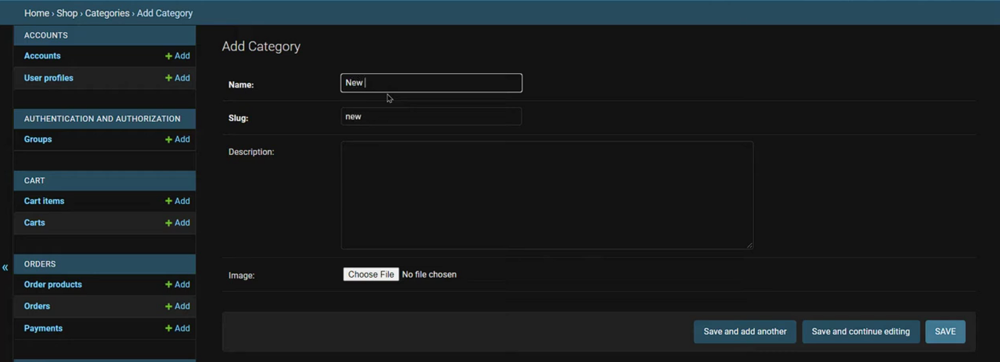
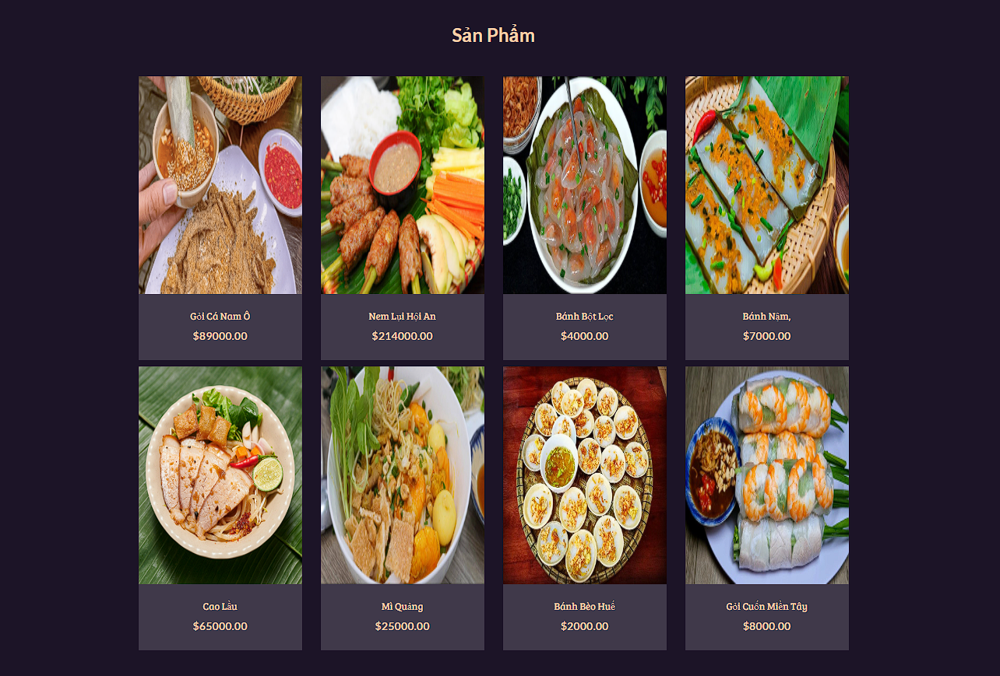
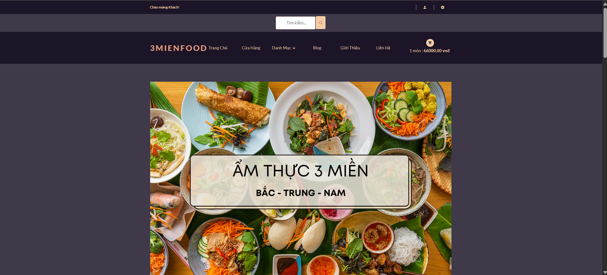

# 🍜 3MIENFOOD Website (Django / JavaScript)

> Full-featured E-commerce Website with PayPal Integration

---

## 📌 Introduction

**3MIENFOOD** is a full-stack e-commerce web application built with **Django** and **JavaScript**, simulating a real-world online shopping system.

It includes essential features such as cart management, payment integration, product reviews, and an admin dashboard.

---

## 🚀 Key Features

* 🛒 Full-featured shopping cart
* 💳 PayPal & Credit/Debit payment integration
* ⭐ Product rating & review system
* 🔍 Product search
* 🎠 Product carousel
* 📄 Pagination
* 👤 User profile & order tracking
* 🛠️ Admin dashboard (manage users, products, orders)
* 🗂️ Category filtering

---

## 📸 Demo

<p align="center">
  
</p>

<p align="center">
  
</p>

<p align="center">
  
</p>

---

## ⚙️ Installation (Windows)

### 1. Clone the repository

```bash
git clone <your-repo-link>
cd <project-folder>
```

### 2. Install virtualenv

```bash
pip install virtualenv
```

### 3. Create virtual environment

```bash
py -m venv venv
```

### 4. Activate environment

```bash
.\venv\Scripts\activate
```

### 5. Install dependencies

```bash
pip install -r requirements.txt
```

### 6. Run server

```bash
py manage.py runserver
```

### 7. Open in browser

👉 http://localhost:8000/

---

## 🔐 Admin Setup

### Create superuser

```bash
py manage.py createsuperuser
```

### Access admin panel

👉 http://localhost:8000/admin

---

## 🧩 Features in Detail

* Full-featured shopping cart
* Product review & rating system
* Product carousel
* Pagination
* Search functionality
* User profile with order history
* Admin product & order management
* Order delivery status update
* Checkout process (shipping, payment, etc.)
* PayPal / Credit Card integration
* Category filtering
* Variable products support
* Blog posting
* Contact page
* Modern UI/UX design
* Unlimited products & categories
* Easy to manage

---

## 📩 Support

If you find any bugs or need help, feel free to contact me

---

## ❤️ Enjoy the project!
